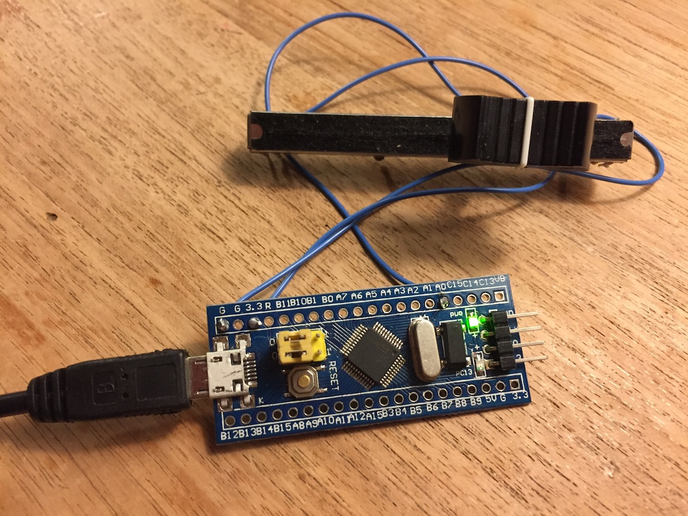

# zynthian-stm32controller
This is hardware and software for an I/O expander for Zynthian using an STM32 microcontroller, connected via USB. My main goal was to add a master volume control. The microcontroller has 16 ADC channels and many GPIOs so it could be used to add more controllers.

The current version supports a single potmeter to control the Alsa mixer volume.



# Hardware
The board (also known as the STM32 Blue Pill) can be bought on AliExpress or ebay from china for less than 2 Euros. Search for 'STM32F103C8T6 module' and see the picture above.

On most boards a hardware modification is needed, R10 has the wrong value. You can either replace R10 with a 1.5k  resistor (this is a tiny 0604 SMD component), or put an appropriate resistor value (e.g 1.8 kΩ) in between PA12 and 3.3V. See for more information: https://wiki.stm32duino.com/index.php?title=Blue_Pill

Use a potmeter somewhere between 5k and 20k. Connet the wiper to A0. Connect the two outer pins to G and 3.3 respectively. See picture above.

# Install firmware
First the stm32duino bootloader must be flashed to the microcontroller. This is a bit involved and requires an SWD programmer, or a USB - serial converter. See 
http://coytbarringer.com/programming-stm32f103-blue-pill-using-usb-bootloader-platformio/
or
https://github.com/rogerclarkmelbourne/Arduino_STM32/wiki/Flashing-Bootloader-for-BluePill-Boards

Next, install the Arduino software (http://arduino.cc)

In Arduino, install the Arduino_STM32 libraries:
https://github.com/rogerclarkmelbourne/Arduino_STM32/wiki/Installation

Launch Arduino and open [zythian-stm32controller.ino](./firmware/zythian-stm32controller/zythian-stm32controller.ino).

Tools - Board: Generic STM32F103C
Tools - Variant: 64k Flash
Tools - CPU speed: 48 MHz
Tools - upload method: STM32duino bootloader

Do Sketch - Verify/Compile to build the firmware.

Finally, program the microcontroller: Connect the microcontroller via USB, press its reset button and do Sketch - Upload. The bootloader only stays active for 1 second (led is flashing), so this must be done within a fraction of a second. If succesful you should see something like this:
```
...
Download	[=======================  ]  93%        20480 bytes
Download	[======================== ]  97%        20908 bytes
Download	[=========================] 100%        20908 bytes
Download done.
```

# Install host software
Connect via SSH to your zythian box and enter:

```
cd /zynthian
git clone --recursive https://github.com/joostn/zynthian-stm32controller.git
cd zynthian-stm32controller
./build.sh
```

This will build the host software and install as /etc/systemd/system/zynthian-stm32controller-host.service.

Connect the microcontroller and verify that it's working by opening alsamixer.

If it's not working, execute  ```/zynthian/zynthian-stm32controller/build/zynthian-stm32controller-host``` and see if you get any error messages.