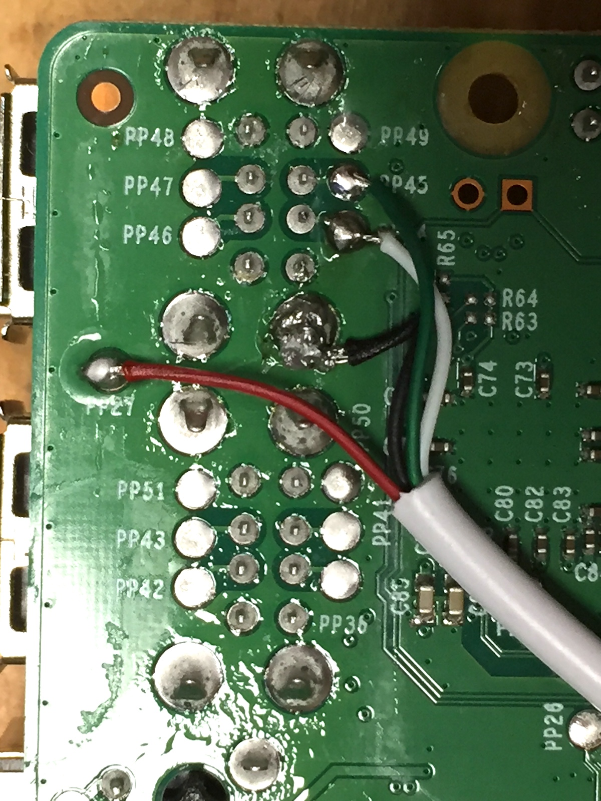

# zynthian-stm32controller
This is hardware and software for an I/O expander for Zynthian using an STM32 microcontroller, connected via USB. My main goal was to add a master volume control. The microcontroller has 9 ADC channels and many GPIOs so it could be used to add more controllers.

The current version supports a single potentiometer to control the Alsa mixer volume.


# Hardware
The board (also known as the STM32 Blue Pill) can be bought on AliExpress or ebay from china for less than 2 Euros. Search for 'STM32F103C8T6 module' and see the picture above.

On most boards a hardware modification is needed, R10 has the wrong value. You can either replace R10 with a 1.5k  resistor (this is a tiny 0603 SMD component), or put an appropriate resistor value (e.g 1.8 kΩ) in between A12 and 3.3V. See for more information: https://wiki.stm32duino.com/index.php?title=Blue_Pill

Use a potentiometer somewhere between 5k and 20k. Connect the wiper to A0. Connect the two outer pins to G and 3.3 respectively. See picture above.

# Install bootloader
First the stm32duino bootloader must be flashed to the microcontroller. This is a bit involved and requires an SWD programmer, or a USB - serial converter. See 

http://coytbarringer.com/programming-stm32f103-blue-pill-using-usb-bootloader-platformio/
or
https://github.com/rogerclarkmelbourne/Arduino_STM32/wiki/Flashing-Bootloader-for-BluePill-Boards

# Install host software
Connect via SSH to your zynthian box and enter:

```
cd /zynthian
git clone --recursive https://github.com/joostn/zynthian-stm32controller.git
cd zynthian-stm32controller
./build.sh
```

This will build the host software and install as /etc/systemd/system/zynthian-stm32controller-host.service.

# Flash firmware
With the bootloader installed on the microcontroller and software installed on the raspberry pi, firmware can be flashed to the microcontroller over USB.

Connect via SSH to your zynthian box and enter:

```
cd /zynthian/zynthian-stm32controller
./updatefirmware.sh
```

You can choose between two firmware versions, for a linear potentiometer or a logarithmic potentiometer. Dedicated potentiometers for analog volume control often have logarithmic taper; any other potentiometers probably has linear taper.

Connect the microcontroller to the Raspberry Pi over USB, or reset the microcontroller board if it was already connected. The device is in DFU (firmware update) mode for one second after booting. The update script continues attempting to flash the firmware until successful.

# Test
Open the mixer:

```
alsamixer
```

Adjust the potentiometer; this should move the master volume.

If it's not working, execute  ```/zynthian/zynthian-stm32controller/build/zynthian-stm32controller-host``` and see if you get any error messages.

# Compile the firmware
Pre-built binary firmware is included. But if you want to compile your own:

Install the Arduino software (http://arduino.cc)

In Arduino, install the Arduino_STM32 libraries:
https://github.com/rogerclarkmelbourne/Arduino_STM32/wiki/Installation

Launch Arduino and open [zynthian-stm32controller.ino](./firmware/zynthian-stm32controller/zynthian-stm32controller.ino).

* Tools - Board: Generic STM32F103C
* Tools - Variant: 64k Flash
* Tools - CPU speed: 48 MHz
* Tools - upload method: STM32duino bootloader

Do Sketch - Verify/Compile to build the firmware.

To program the microcontroller, connect it via USB to your computer, press its reset button and do Sketch - Upload. The bootloader only stays active for 1 second (led is flashing), so this must be done within a fraction of a second. If succesful you should see something like this:
```
...
Download	[=======================  ]  93%        20480 bytes
Download	[======================== ]  97%        20908 bytes
Download	[=========================] 100%        20908 bytes
Download done.
```
# Internal USB connection
To connect the microcontroller inside the zynthian box I've cut a USB cable in two and soldered as follows:


```
PP45   - green - D+
PP44   - white - D-
shield - black - GND
PP27   - red   - +5V
```

Fix the cable to the PI with some hot glue. This is the topmost of the 2 stacked USB ports, make sure nothing is connected externally.
